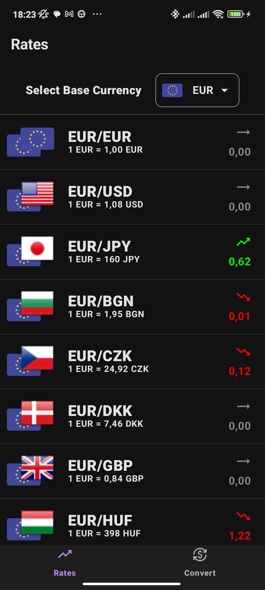
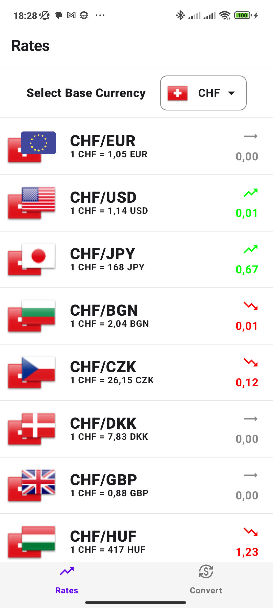
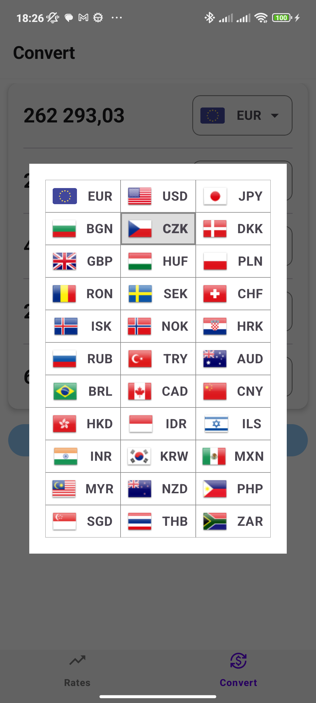
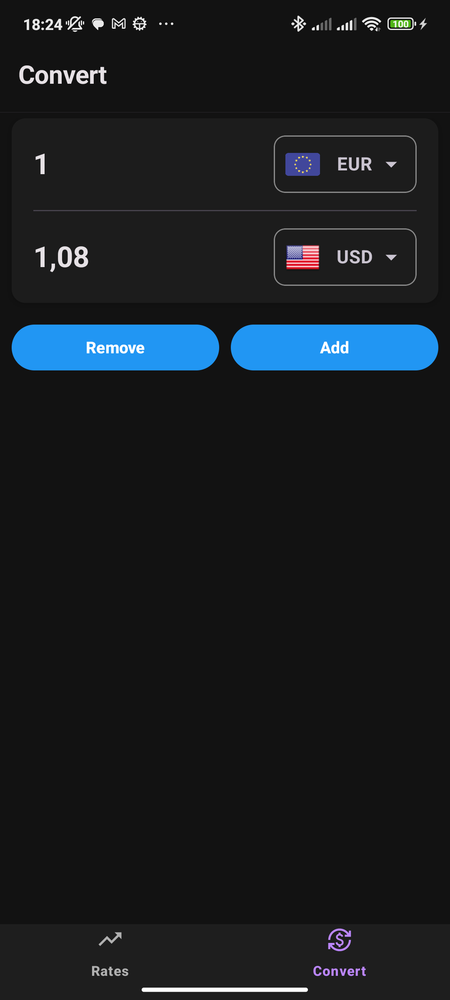
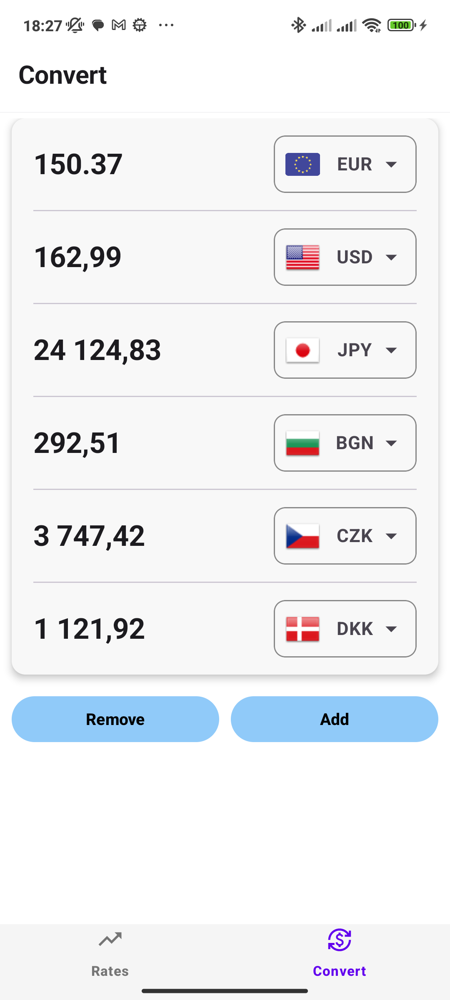

# Currency Converter App

A simple **currency converter** app built with **Jetpack Compose** that allows users to view exchange rates and convert currencies.

---

## Features 🚀
- **Currency Rates Screen**
  - View all available currencies
  - Show their values related to a selectable base currency
  - Show change compared to previous day
- **Currency Converter Screen**
  - Animated adding of multiple fields for conversion
  - Real-time updates while typing

---

## Screenshots 📱
| Rates Screen Dark | Rates Screen Light | Select Currency Light | 
| --------- | ------------ | ---------- | 
|  |  |  | 
| Convert Screen Dark | Convert Screen Light | Splash Screen |
|  |  |  | 

---

## Demo 🎥

 

---

## Tech Stack 🛠️
- **Kotlin**
- **Jetpack Compose**
- **Material 3**
- **Custom Composables**
- **Navigation**
- **Coroutines** 
- **API Calls - FreeCurrencyAPI**  
- **Splash Screen**
- ❌ no **ROOM Data Persistence** in this project
---

## License 📄
This project is licensed under the **MIT License** - see the [LICENSE](LICENSE) file for details.

---

## Contact 📫
For any inquiries or feedback, feel free to contact me:
- **LinkedIn:** [Marek Storek](https://www.linkedin.com/in/marekstorek)
- **Email:** marek.storek1@gmail.com
